  <!-- Hero Banner with Auto Dark / Light theme switching -->
  <picture>
    <source media="(prefers-color-scheme: dark)" srcset="https://raw.githubusercontent.com/Javed-khan-7786k/Javed-khan-7786k/main/dark.svg">
    <source media="(prefers-color-scheme: light)" srcset="https://raw.githubusercontent.com/Javed-khan-7786k/Javed-khan-7786k/main/light.svg">
    
  </picture>

 

  

 

---

### ⚡ Quick About Me

- 🔭 I’m currently building high-performance web applications using **Next.js 14, Node.js, and TypeScript**.
- 🧠 Deeply interested in **AI Agents, Cloud Microservices, and System Architecture**.
- 👯 Looking to collaborate on **Open Source Projects, Full-Stack SaaS Platforms, and Developer Tools**.
- 💬 Ask me about **React, Next.js, Node.js, PostgreSQL, Docker, AWS**.
- 📫 Reach out to me: **javed.dev.tech@gmail.com**

---

### 🛠️ Tech Stack & Skills

  
  
  
  
  
  
  
   
  
  
  
  
  
  

---

### 📊 GitHub Analytics

  <table border="0">
    <tr>
      <td>
        
      </td>
      <td>
        
      </td>
    </tr>
  </table>

   

  

---

### 🌐 Connect & Socials

  
  
  

 

  Designed &amp; Crafted with ❤️ by <a href="https://github.com/Javed-khan-7786k">Javed Khan</a>

